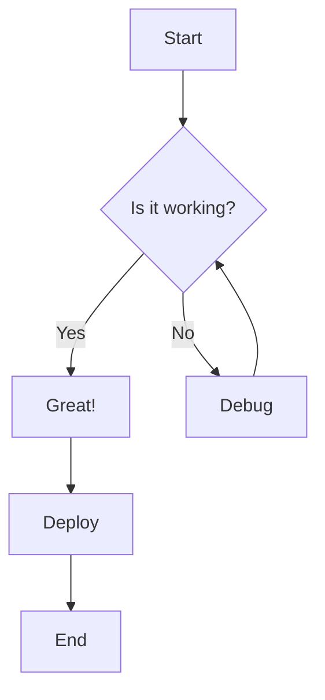
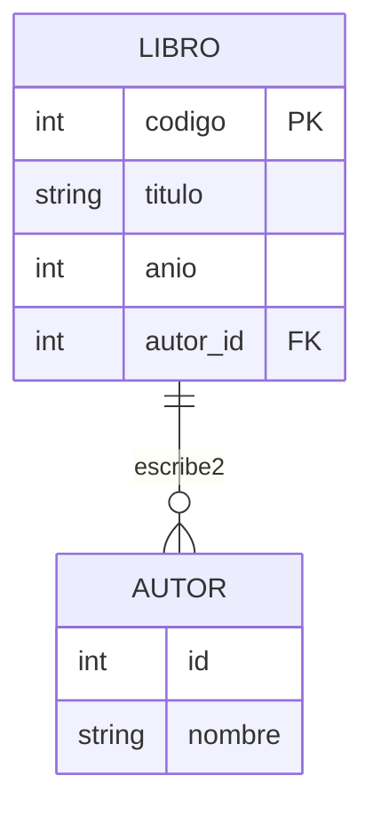

```mermaid
flowchart TD
    A[Start] --> B{Is it working?}
    B -->|Yes| C[Great!]
    B -->|No| D[Debug]
    D --> B
    C --> E[Deploy]
    E --> F[End]
 
```

```mermaid
erDiagram
    LIBRO {        
       int codigo PK        
       string titulo       
       int anio        
       int autor_id FK    
    }
 
    AUTOR{
        int id 
        string nombre
    }
 
      LIBRO ||--o{AUTOR : escribe2
 
```
## SEGUNDO MD
 

```mermaid
erDiagram
    LIBRO {        
       int codigo PK        
       string titulo       
       int anio        
       int autor_id FK    
    }
 
    AUTOR{
        int id 
        string nombre
    }
 
      LIBRO ||--o{AUTOR : escribe2
```
