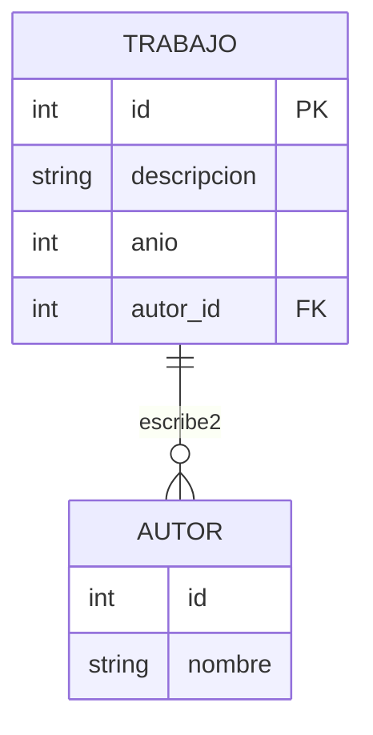

```mermaid
erDiagram
    TRABAJO {        
       int id PK        
       string descripcion       
       int anio        
       int autor_id FK    
    }
 
    AUTOR{
        int id 
        string nombre
    }
 
      TRABAJO ||--o{AUTOR : escribe2
 
```
