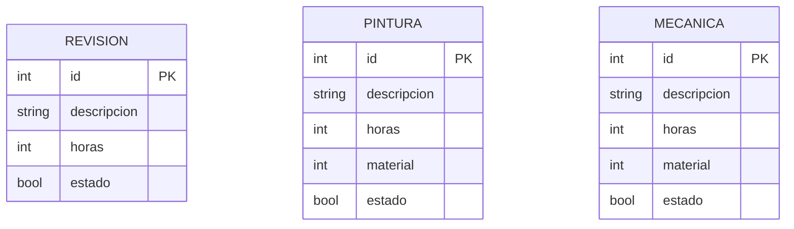

```mermaid
erDiagram
    REVISION {        
       int id PK        
       string descripcion
       int horas
       bool estado       
    }
    PINTURA {        
       int id PK        
       string descripcion
       int horas
       int material
       bool estado       
    }
    MECANICA {        
       int id PK        
       string descripcion
       int horas
       int material
       bool estado 
    } 
```
